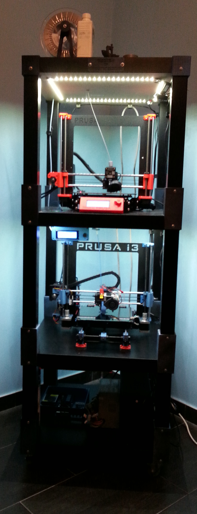

# Obelisk of Fabrication

A tower to hold, feed and control RepRap machines.

## Licensing

Unless otherwise specified, code and objects are released under the *GNU General Public License v3* and *Creative Commons - Attribution-ShareAlike* respectively.

## Proof of concept

